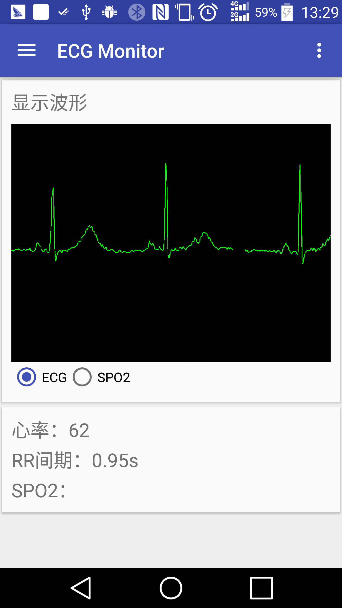
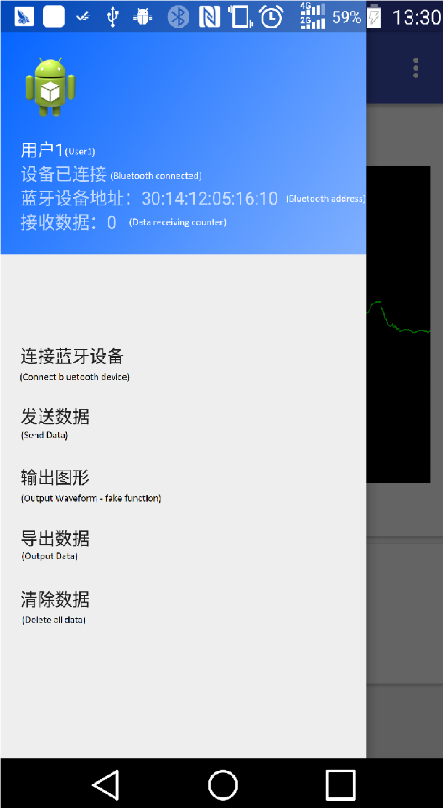
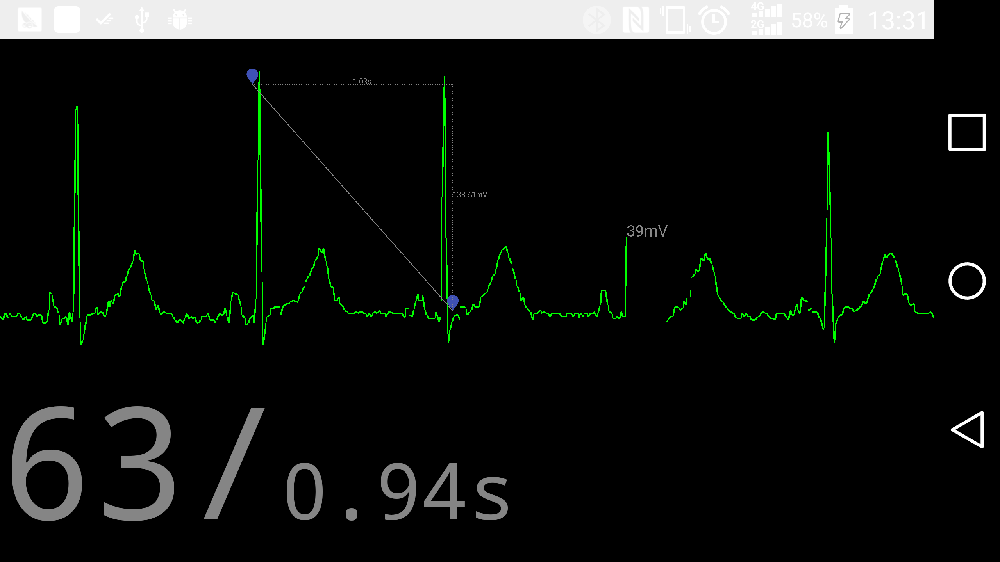

# A Simple ECG Monitor for Android Platform

## What is this?

ECG Monitor is a simple ECG Wave displaying APP. After connecting to a Bluetooth serial port device, 
it allows your Android device to show and analysing the ECG data received from the connected Bluetooth serial port. 

## How is it like?

After launching the app, you should see this:

Sliding from the left, a menu should be shown:

Changing the device into landscape and details of the waveform should be shown:

## How to use it?

To compile the project, please install the Android Studio first. Also you should install Android API 26(Android 8.0) or higher version.  

To use it, Your HC-05 module's Bluetooth address needs to be hardcoded in line [bluetoothManager.java:46](https://github.com/chickenjohn/ECG_Monitor_on_Android/blob/768390a93384210c72c818f747d2866f219e2795/app/src/main/java/com/experiment/chickenjohn/materialdemo/bluetoothManager.java#L46). Connect it to your PC by using the serial-port-to-USB converter, check the serial port number on your PC and modify the port ID in SendWaveTool/sendwave.py. 

Then launch the ECG Monitor App. The app should begin searching and connecting the bluetooth by itself. After it is connected, execute the sendwave.py program. The app should run normally now. 

If you switch your device to landscape, touch your device to measure the wave.

## For more info

Please submit issues if you have more questions. 
